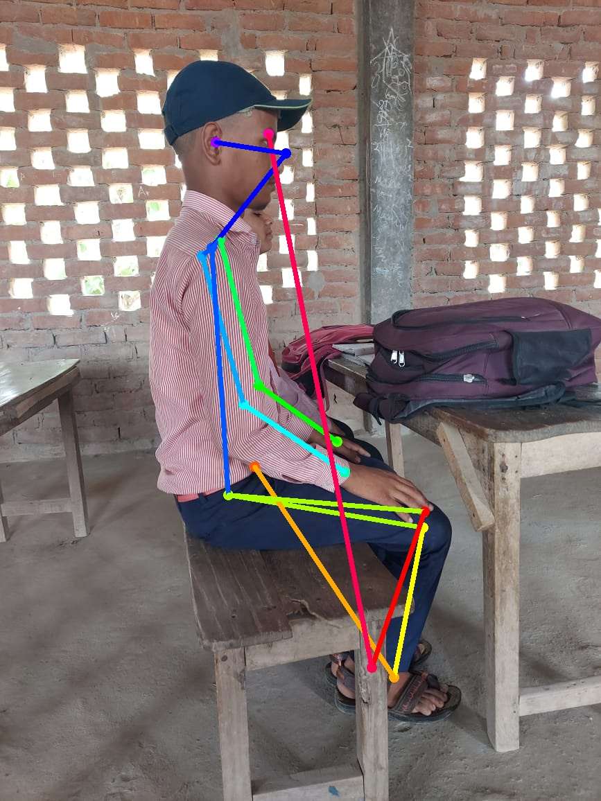

## Sitting Posture Recognition

**This is a software that can output the sitting position of a person when the lateral view (side view) of the person is given as input**. 

The output can tell you whether a person is sitting in a *Straight position*, *Hunchback position* (leaning forward), *Reclined position* (leaning backward) and if the person is *Folding Hands* and *Folding Legs* (Kneeling Position).

- This uses the [Open Pose](https://github.com/CMU-Perceptual-Computing-Lab/openpose) model which was invented by [CMU Perceptual Computing Lab](https://github.com/CMU-Perceptual-Computing-Lab/). 
- This OpenPose model can detect the keypoints of the human body. These keypoints co-ordinates can be used to estimate the sitting posture of the person.

- I have used a trained keras model of OpenPose to detect the keypoints. You can download the model from [here](https://www.dropbox.com/s/llpxd14is7gyj0z/model.h5)

- [Here](https://github.com/ZheC/Realtime_Multi-Person_Pose_Estimation) is the original implementation by it's authors.
 
- I have tested this software with images of school kids as the main objective of this software, to  help them improve their sitting posture. You can find these images in `sample_images` folder.

## Files
`model.py` - contains architecture of the model.

`config_reader.py` - contains the parameters that are essential for the model to predict the key points. Keeping the specifications of the system in mind.

`util.py` - some functions required to calculate the co-ordinates of the key points.

### Usage 

1. Please install all the requirements from requirements.txt.
2. Run `python3 posture_image.py` for testing this software with an image as input. If you wish to test it with your own image, put that image in `sample_images` folder and change accordingly on `line 237`.
3. The code also saves the output image and the text output in the results folder so according use a numaric value such as "1" or any other integer value to save in both the 319 and 320 you can open the outup folder in results for better understanding 
4. After that run the `python 3 plot.py` file to get a plot of the results of all the images that you used while performing the detection. 
## Examples

**NOTE**: There are many examples, you can see all of the trials in [RESULTS.md](RESULTS.md).
You can see the plot made by the test images in [plot.md](plot.md).
For the below image:

we would get the following output

